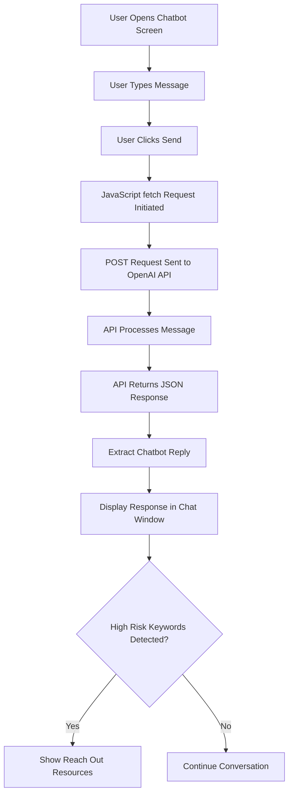

```mermaid
flowchart TD
    A[User Opens Chatbot Screen] --> B[User Types Message]
    B --> C[User Clicks Send]
    C --> D[JavaScript fetch Request Initiated]
    D --> E[POST Request Sent to OpenAI API]
    E --> F[API Processes Message]
    F --> G[API Returns JSON Response]
    G --> H[Extract Chatbot Reply]
    H --> I[Display Response in Chat Window]
    I --> J{High Risk Keywords Detected?}
    J -- Yes --> K[Show Reach Out Resources]
    J -- No --> L[Continue Conversation]
```
